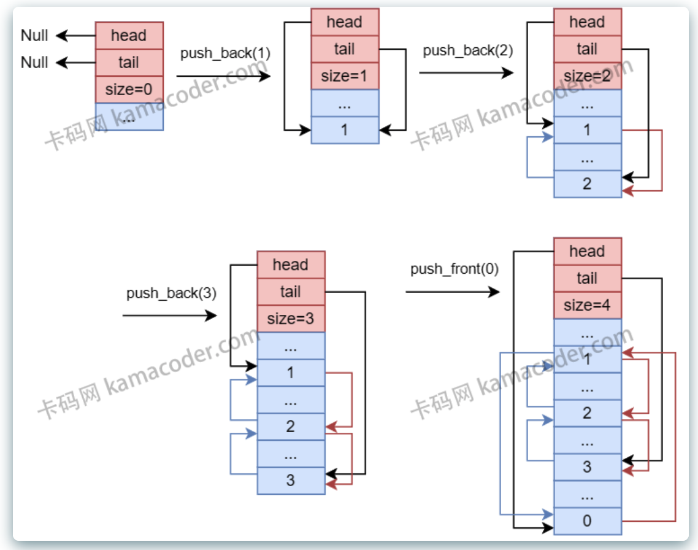

# list
std::list 和 std::vector 是两种不同的数据结构，std::vector 是基于数组的动态数组，而 std::list 是基于双向链表的数据结构。

list适用于需要在序列中执行频繁插入和删除操作的场景。

## list的特性
* 双向链表： list是一个双向链表，允许在序列的两端和中间执行高效的插入和删除操作。
* 不支持随机访问： 与vector和deque不同，list不支持通过索引进行常量时间内的随机访问。要访问list中的元素，必须通过迭代器进行。
* 动态内存管理： list的内部实现使用节点，每个节点都包含一个元素和指向前后节点的指针。这种结构使得list在执行插入和删除操作时能够更好地管理内存。
* 保持迭代器有效性： list在进行插入和删除操作时，能够更好地保持迭代器的有效性。这意味着在进行这些操作后，不会导致所有迭代器失效。
* 高效的插入和删除操作： 由于list是双向链表，插入和删除操作在两端和中间都是常量时间的，使其成为处理这类操作的理想容器。

## list的性能考虑
* 插入和删除操作： 如果主要进行频繁的插入和删除操作，并且不需要随机访问元素，list可能比vector和deque更为高效。
* 随机访问： 如果需要通过索引进行随机访问元素，使用vector可能更为合适，因为它提供了常量时间的随机访问。
* 内存使用： 由于list使用了链表结构，可能引入一些额外的内存开销。在内存使用方面，vector和deque可能更为紧凑

## list 工作原理

图例说明
* 蓝色矩形框：堆内存
* 红色矩形块：栈内存
* 红色箭头：next指针
* 蓝色箭头：prev指针

## 面试题
### 1. C++ STL list 的特性
题目：描述 C++ STL list 的特性，包括其内部工作机制和用途。

参考答案：

C++ STL list 是一个序列容器，它允许非连续内存分配。以下是 list 的一些主要特性：
* 双向链表：list 是一个双向链表，允许从两个方向遍历。
* 非连续内存：由于它是链表，元素不存储在连续的内存位置。这意味着除了通过迭代器外，无法通过常规索引来访问元素。
* 动态大小：与数组不同，list 可以根据需要动态增长或缩减。
* 插入和删除性能：在任意位置插入和删除元素都非常快，时间复杂度为 O(1)。
* 不支持随机访问：由于其内部实现，list 不支持快速随机访问，所以访问元素的时间复杂度为 O(n)。
* 额外内存开销：每个元素都需要额外的内存来存储前后元素的指针。

list 通常用于以下用途：
* 当需要频繁在列表中间插入或删除元素时。
* 当不需要快速随机访问元素时。
* 当需要保证迭代器在插入和删除操作后不失效时。

### 2. list 的迭代器失效情况
题目：在对 STL list 进行插入和删除操作时，哪些情况下迭代器会失效？

参考答案：

对于 STL list 来说，迭代器失效的情况相对较少。由于 list 是一个双向链表，迭代器在插入和删除操作之后通常仍然有效。具体来说：
* 插入操作：在 list 中插入操作不会导致任何现有迭代器失效，包括指向插入位置的迭代器。插入操作后，原来的迭代器仍然指向它们原来指向的元素。
* 删除操作：删除操作会导致指向被删除元素的迭代器失效。然而，其他迭代器，包括指向前一个和后一个元素的迭代器，仍然有效。

### 3. list 与 vector 的比较
题目：比较 C++ STL list 和 vector，它们的优势、劣势和适用场景是什么？

参考答案：

list 和 vector 是 C++ STL 中的两种常用序列容器，它们各有优缺点。
* 内部实现：
    * list 是一个双向链表，不支持随机访问。
    * vector 是一个动态数组，支持快速随机访问。
* 性能特点：
    * list：
        * 插入和删除操作快（O(1)），不论在容器中的哪个位置。
        * 遍历操作慢（O(n)），因为它不支持随机访问。
    * vector：
        * 插入和删除操作在尾部快（O(1)），但在中间或开头慢（O(n)），因为可能需要移动元素。
        * 遍历- 内部实现：
    * vector 是基于连续内存空间的动态数组实现，这意味着它的元素存储在一个连续的内存块中。
    * list 是基于双向链表实现的，它的每个元素都是单独的内存块，通过指针连接。
* 性能特点：
    * vector：
        * 支持随机访问，可以通过索引以 O(1) 时间复杂度访问任意元素。
        * 尾部插入和删除操作快（通常是 O(1)），但在中间或开头插入或删除元素需要移动后续元素，可能导致 O(n) 时间复杂度。
        * 当超出当前容量时，需要重新分配内存并复制所有元素到新空间，这是一个相对昂贵的操作。
    * list：
        * 不支持随机访问，访问特定元素需要 O(n) 时间复杂度。
        * 在任意位置插入和删除操作都很快（O(1)），因为只需要改变指针。
        * 不需要重新分配整个容器的内存空间，因为它不是连续存储的。
* 内存使用：
    * vector 通常有较小的内存开销，因为它不需要为每个元素存储额外的指针。
    * list 对于每个元素都需要存储两个额外的指针（前驱和后继），这意味着更高的内存开销。
* 迭代器失效：
    * vector 的迭代器在重新分配内存后可能会失效，或者在除了尾部之外的任何位置进行插入或删除操作时会失效。
    * list 的迭代器在插入和删除操作后依然有效，除了被删除元素的迭代器外。
* 适用场景：
    * vector 适合用于元素数量固定或仅在尾部进行添加和删除操作的场景，以及需要频繁随机访问元素的场景。
    * list 适合用于元素数量经常变动，特别是需要在列表中间频繁进行插入和删除操作的场景。
