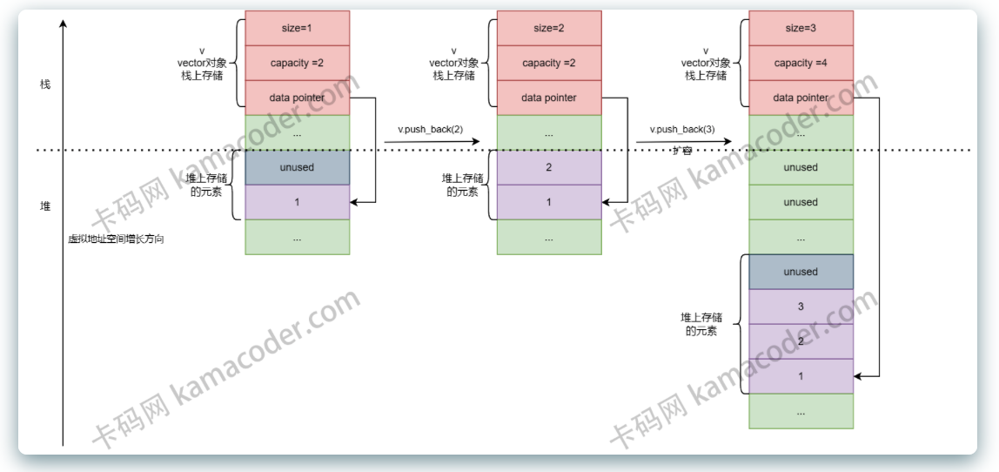

[TOC]

# vector
std::vector 是一个动态数组，它在内存中以连续的块存储元素。与静态数组相比，std::vector 允许在运行时动态调整大小，而无需手动管理内存。

## 内存管理
std::vector 维护了两个重要的状态信息：容量（capacity）和大小(size)。

容量表示当前 vector 分配的内存空间大小，而大小表示 vector 当前包含的元素数量。

当向 vector 中添加元素时，如果元素数量超过了容量，就需要进行内存重新分配。

内存分配和释放是 std::vector 内部的重要操作。

当容量不足以容纳新元素时，std::vector 会分配一块新的内存空间，将原有元素复制到新的内存中，然后释放原内存。这个过程确保了元素的连续存储。

动态扩容策略：
> 为了提高性能，std::vector 采用了一种称为“指数增长（exponential growth）”的策略进行动态扩容。
>
> 当需要进行扩容时，std::vector 通常会将容量翻倍，以避免频繁的内存分配操作，从而减少系统开销。
> 
> 这种指数增长策略确保了平均情况下的插入操作具有常数时间复杂度，而不是线性时间复杂度。

随机访问和迭代器：
> std::vector 提供了高效的随机访问能力，即通过索引直接访问元素。这是因为元素在内存中是连续存储的，通过简单的指针运算即可实现 O(1) 时间复杂度的访问。

性能考虑：
> std::vector 在许多场景下表现出色，但需要注意的是，在频繁插入或删除元素的情况下，std::vector 可能不是最佳选择，因为这样的操作可能触发频繁的动态扩容，导致性能下降。
> 
> 在这种情况下，考虑使用 std::deque 或 std::list 这样的容器（后面会有讲解），它们对插入和删除操作有更好的性能。

vector的基本用法:

它位于 头文件中，使用时需要包含该头文件`<vector>`
```
#include <iostream>
#include <vector>

int main() {
    // 创建一个空的 vector
    std::vector<int> myVector;

    // 使用初始化列表创建 vector
    std::vector<int> myVector2 = {1, 2, 3, 4, 5};

    // 在尾部插入元素
    myVector.push_back(42);

    // 使用下标访问元素
    std::cout << "First element: " << myVector[0] << std::endl;

    // 打印 vector 的大小
    std::cout << "Size of myVector: " << myVector.size() << std::endl;

    return 0;
}
```

## vector 工作原理:
> C++中vector的数组内存通常是在堆上分配的。当创建一个vector对象时，对象本身（即vector的控制结构，包括指向数据的指针、大小和容量等）通常存储在栈上（如果是局部变量）或其他存储区（如全局/静态存储区），但实际的元素数据是在堆上分配的。这种设计允许vector在运行时动态增长和收缩，因为堆是用于动态内存分配的区域，没有固定的大小限制（除了可用内存的物理限制）。当调用vector的push_back等方法时，vector可能会重新分配其底层的动态数组以适应新元素。这通常涉及申请新的更大的内存块，复制现有元素到新内存，添加新元素，然后释放旧的内存块。在C++官方实现的vector中，这种动态内存管理通常是通过分配器来完成的，vector使用一个默认的分配器std::allocator，它封装了动态内存分配函数，如new和delete。开发者也可以为vector提供自定义的分配器，以适应特定的内存分配策略。
> 
> 以上的内容配合下图说明就显得通俗易懂了：

图例说明如下：
> 1. 虚线以上的内存为栈内存，虚线以下的内存为堆内存
> 2. 红色区域为vector对象控制结构存储的位置
> 3. 紫色区域和灰色区域为存储元素的数组的位置, 其中紫色区域表示已经使用, 灰色区域表示未使用
> 
> 在这个案例中, 有一个vector<int> v对象, 其控制结构存储在在了栈上, 包括size, capacity, data pointer,分别表示数组已经使用的大小、数组的容量、数组的首地址, 最左边表示初始时刻的堆栈状态, 某时刻调用v.push_back(2), 检查发现此操作不会超出容量上限, 因此在中间的堆栈示意图中插入了2, 并更新控制结构中的size = 2, 下一时刻调用v.push_back(3), 此时检查发现此操作要求的容量不足, 因此需要重新在堆内存申请容量为4的内存空间, 如最右边的示意图所示, 并且复制原来的内容到新的地址, 完成此操作后可以丢弃原来的堆内存空间, 并插入3。

## 常见面试题
C++ 标准模板库 (STL) 中的 std::vector 是面试中常见的话题，因为它是用于表示动态数组的基本容器。

以下是一些关于 std::vector 的常见面试题及其解答：
### 1. std::vector的扩容过程
当向 std::vector 添加元素并且当前容量不足以容纳新元素时，std::vector 会进行扩容。这通常涉及以下步骤：
* 分配一个更大的内存块，通常是当前大小的两倍（这个增长因子取决于实现）。
* 将当前所有元素移到新分配的内存中。
* 销毁旧元素，并释放旧内存块。
* 插入新元素。

这个过程中的复制和移动操作可能会导致性能开销，尤其当元素具有复杂的拷贝构造函数或移动构造函数时。

### 2. 解释 std::vector::push_back 和 std::vector::emplace_back 的区别。
std::vector::push_back 和 std::vector::emplace_back 都是在 std::vector 的末尾添加一个新元素，但它们添加元素的方式不同：
* push_back 会对给定的对象进行拷贝或移动构造，以将元素添加到 vector 的末尾。
* emplace_back 则使用给定的参数直接在 vector 的末尾构造一个元素，无需拷贝或移动操作，这通常更高效。

### 3. 什么时候会使用 std::vector::reserve()？
std::vector::reserve() 用于预分配内存，以避免在添加新元素时重新分配内存。

当知道将要存储大量元素，但又不想在每次插入时都可能发生内存重新分配时，使用 reserve() 可以提高性能。

这样可以减少因扩容导致的不必要的内存分配和元素拷贝。

### 4. 如何减少 std::vector 占用的空间？
可以使用 std::vector::shrink_to_fit 方法来请求移除未使用的容量，减少 vector 的内存使用。

这个函数是 C++11 引入的，它会尝试压缩 std::vector 的容量，使其等于其大小。但是，这只是一个请求，并不保证容量会减少，因为这依赖于实现。

### 5. 如何检查 std::vector 是否为空？
使用 std::vector::empty() 方法可以检查 vector 是否没有元素。

这比使用 size() 方法（比较 size() == 0）更首选，因为 empty() 通常可以保证是常数时间复杂度的操作。

### 6. 什么是迭代器失效? 如何避免?
当 vector 进行操作，如增加或删除元素，尤其是在中间插入或删除元素时，迭代器可能会失效。例如：

如果 vector 进行了重新分配，所有指向元素的迭代器都会失效。

如果在 vector 中间插入或删除元素，从该点到末尾的所有迭代器都会失效。

解决方案是最好使用标准库提供的算法，如 std::remove 和 std::remove_if 结合 vector::erase 方法来删除元素。这些算法在设计时已经考虑了迭代器失效的问题。

### 7. 如果 std::vector 的元素是指针，需要注意什么？
当 vector 的元素是指针对 std::vector 元素为指针的情况，需要注意以下几点：

* **内存管理：** 如果 std::vector 存储的是原始指针，那么仅仅清空 vector 或者让 vector 被销毁，并不会释放指针所指向的内存。因此，需要确保在 vector 被销毁之前，逐个删除所有动态分配的对象。

* **所有权和生命周期：** 需要确保在 vector 所包含的指针被使用期间，指向的对象是有效的。同时，需要清楚地定义谁拥有这些对象的所有权，以及在何时何地进行释放。

* **异常安全：** 如果在创建和填充 vector 的过程中遇到异常，需要有一个清晰的机制来处理已经分配的内存，以避免内存泄漏。

* **智能指针：** 为了简化内存管理，推荐使用智能指针（如 std::unique_ptr 或 std::shared_ptr）作为 vector 的元素类型。这样，当 vector 被清空或销毁时，智能指针会自动释放它们所拥有的资源。

* **避免悬垂指针：** 当指针指向的对象被删除或移动时，需要确保没有悬垂指针指向无效的内存地址。同样，当 vector 被重新分配时，如果存储的是指向其他元素的指针，这些指针也会失效。
* **深拷贝与浅拷贝：** 如果需要复制这样的 vector，就需要决定是进行深拷贝（复制指针指向的对象）还是浅拷贝（仅复制指针本身）。正确地选择取决于应用需求和所有权策略。
